# 任务二 LeNet-5 的 MindSpore 框架训练实验报告

## 1. 任务完成摘要

在任务二中，我学习了一些人工智能的发展历史，了解了人工智能在发展中遇到的挫折，人们是解决这些问题的方法，以及人工智能发展史上的几个里程碑。我也学习了一些理论知识，比如人工神经网络的基本原理，BP 神经网络的原理，卷积神经网络的基本原理，LeNet 经典组成结构等等。我还进行了一些实践，成功运行了基于 BP 神经网络的手写数字识别举例，然后自己使用BP神经网络对正弦曲线进行了拟合，并绘图比较了效果。最后，我了解了 MindSpore 框架，并成功运行了基于 MindSpore 框架的 LeNet-5。在将数据集从 MNIST 更换为 Fashion_MNIST后，我还对LeNet做出了一些改动来尝试提高模型的准确率。

## 2. 任务目标

1. 用 BP 神经网络拟合正弦曲线，并绘图比较实际效果

2. LeNet 的 MindSpore 实现

## 3. 主要内容

### 3.1. 用 BP 神经网络拟合正弦曲线，并绘图比较实际效果

#### 神经网络设置

模型核心参数：

```python
mlp = MLPRegressor(
    hidden_layer_sizes=(100, 100),
    activation="tanh",
    solver="adam",
    alpha=1e-4,
    learning_rate="adaptive",
    max_iter=10000,
    tol=1e-6,
    random_state=42,
)
```

使用 `sklearn.neural_network` 中的 `MLPRegressor` 。

**参数设置如下：**

1. hidden_layer_sizes=(100, 100)

   定义了神经网络的隐藏层结构，指定两个隐藏层，每个隐藏层有 100 个神经元。

2. activation="tanh"

	使用的激活函数是 tanh。
	
3. solver="adam"

	使用 Adam 作为优化器。
	
4. alpha=1e-4

	这是 L2 正则化参数，防止模型过拟合。
	
5. learning_rate="adaptive"

	设置学习率为自适应，初始学习率是固定的，但如果模型的性能不再提升（即损失不再减少），则学习率会自动降低，避免陷入局部最优或过早收敛。
	
6. max_iter=10000

	设置最大迭代次数为 10000。
	
7. tol=1e-6

	设置收敛条件的容差（tolerance）。如果损失函数在连续几次迭代中的改变量小于 1e-6，模型训练就会停止。
	
8. random_state=42

	随机种子设置为 42，确保每次运行时结果是可重复的。

#### 运行效果

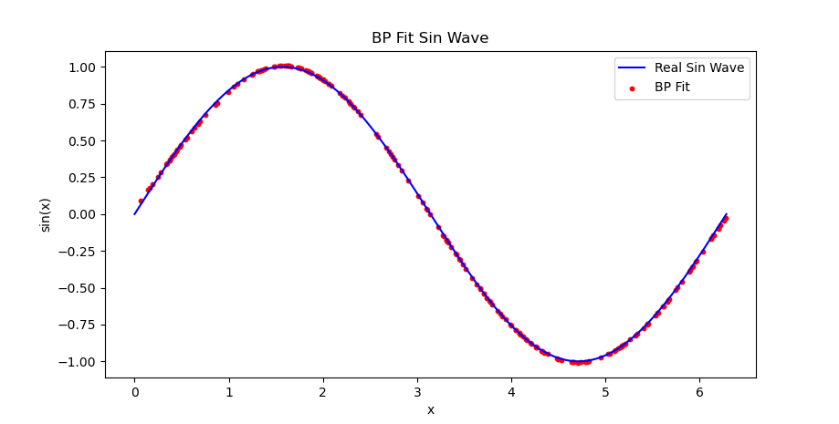

可以看出，拟合数据基本贴近真实值，再输入一些离散数值看看误差。


可以看到，误差控制在 1e-2 以下，准确率达到 99%。

### 3.2. LeNet 的 MindSpore 实现

#### 神经网络设置

```python
class LeNet5(nn.Cell):
    """Lenet network structure."""

    # define the operator required
    def __init__(self, num_class=10, num_channel=1):
        super(LeNet5, self).__init__()
        self.conv1 = nn.Conv2d(num_channel, 6, 5, pad_mode="valid")
        self.conv2 = nn.Conv2d(6, 16, 5, pad_mode="valid")
        self.fc1 = nn.Dense(16 * 5 * 5, 120, weight_init=Normal(0.02))
        self.fc2 = nn.Dense(120, 84, weight_init=Normal(0.02))
        self.fc3 = nn.Dense(84, num_class, weight_init=Normal(0.02))
        self.relu = nn.ReLU()
        self.max_pool2d = nn.MaxPool2d(kernel_size=2, stride=2)
        self.flatten = nn.Flatten()

    # use the preceding operators to construct networks
    def construct(self, x):
        x = self.max_pool2d(self.relu(self.conv1(x)))
        x = self.max_pool2d(self.relu(self.conv2(x)))
        x = self.flatten(x)
        x = self.relu(self.fc1(x))
        x = self.relu(self.fc2(x))
        x = self.fc3(x)
        return x
```

使用了经典的 LeNet-5 架构。

**下面是训练时一些超参数的设置：**

1. batch_size=64

   一次输入64个样本来计算梯度并更新权重，过大的 batch_size 会增加内存需求，过小则可能导致训练不稳定或慢收敛。

2. lr=0.01

   设置模型每次更新权重时的步长为0.01，如果学习率太大，模型会收敛困难；如果学习率太小，则模型收敛会非常慢。

3. momentum=0.9

   设置 `momentum` 优化器的参数，模型在更新权重时不仅会考虑当前的梯度，还会参考上一次更新时的梯度，并以90%的权重保留。这样可以加速收敛并平滑优化过程。

#### 运行效果


可以看到，模型在 MNIST 数据集上的准确率非常高，达到了98%。

## 4. 主要思路及关键步骤

### 对 LeNet-5 的改进

使用 Fashion_MNIST 替代 MNIST 后，模型的准确率衰减到了0.85左右，于是我对模型做出了一些改进来尝试提高其在 Fashion_MNIST 上的准确率。

#### 提高模型宽度

通过增加卷积核数量，提升了模型的宽度。

原网络：

```python
# 1 -> 6 -> 16 -> 120 -> 84 -> 10
self.conv1 = nn.Conv2d(num_channel, 6, 5, pad_mode="valid")
self.conv2 = nn.Conv2d(6, 16, 5, pad_mode="valid")
self.fc1 = nn.Dense(16 * 5 * 5, 120, weight_init=Normal(0.02))
self.fc2 = nn.Dense(120, 84, weight_init=Normal(0.02))
self.fc3 = nn.Dense(84, num_class, weight_init=Normal(0.02))
```

修改后：

```python
# 1 -> 32 -> 64 -> 128 -> 256 -> 10
self.conv1 = nn.Conv2d(num_channel, 32, 5, pad_mode="valid")
self.conv2 = nn.Conv2d(32, 64, 5, pad_mode="valid")
self.fc1 = nn.Dense(64 * 5 * 5, 128, weight_init=Normal(0.02))
self.fc2 = nn.Dense(128, 256, weight_init=Normal(0.02))
self.fc3 = nn.Dense(256, num_class, weight_init=Normal(0.02))
```

**结果**


模型准确度提高了约0.015，但是不太稳定。

#### 添加批量规范化层（Batch Normalization）

原代码：

```python
self.conv1 = nn.Conv2d(num_channel, 32, 5, pad_mode="valid")
self.conv2 = nn.Conv2d(32, 64, 5, pad_mode="valid")

x = self.max_pool2d(self.relu(self.conv1(x)))
x = self.max_pool2d(self.relu(self.conv2(x)))
```

修改后：

```python
self.conv1 = nn.Conv2d(num_channel, 32, 5, pad_mode="valid")
self.bn1 = nn.BatchNorm2d(32)
self.conv2 = nn.Conv2d(32, 64, 5, pad_mode="valid")
self.bn2 = nn.BatchNorm2d(64)

x = self.max_pool2d(self.relu(self.bn1(self.conv1(x))))
x = self.max_pool2d(self.relu(self.bn2(self.conv2(x))))
```

**结果**

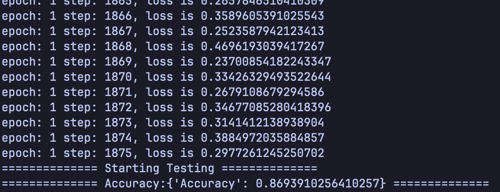

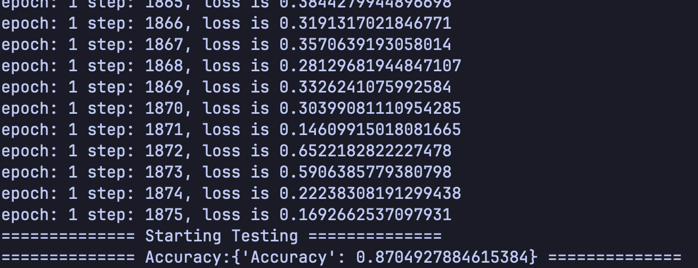

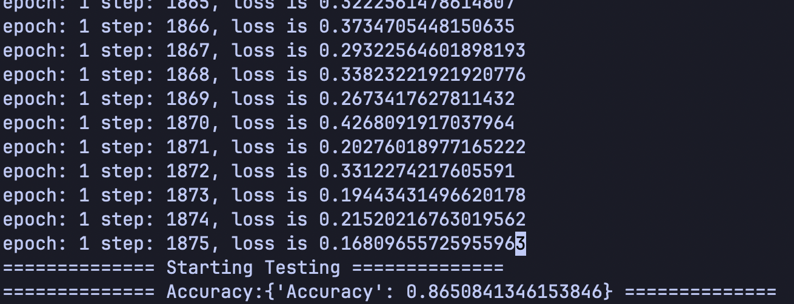

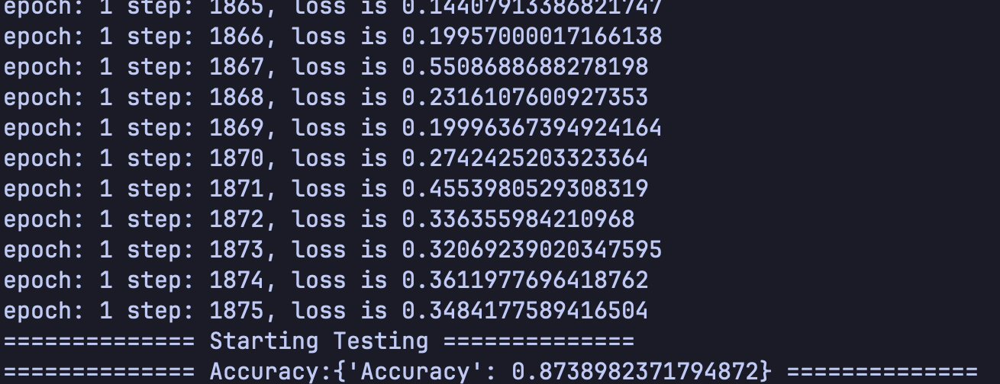

模型准确度提高到约0.87，并且较为稳定。

#### 优化器切换为 Adam

原代码：

```python
net_opt = nn.Momentum(net.trainable_params(), lr, momentum)
```

修改后：

```python
net_opt = nn.Adam(
    net.trainable_params(),
    learning_rate=lr,
    weight_decay=0.0,
    use_lazy=False,
    use_offload=False,
)
```

**结果**

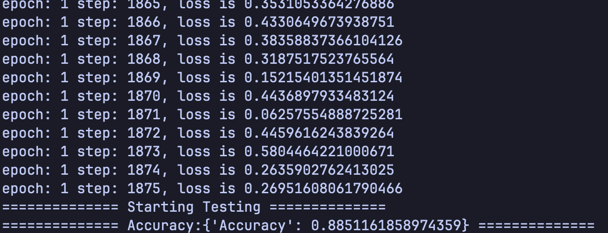

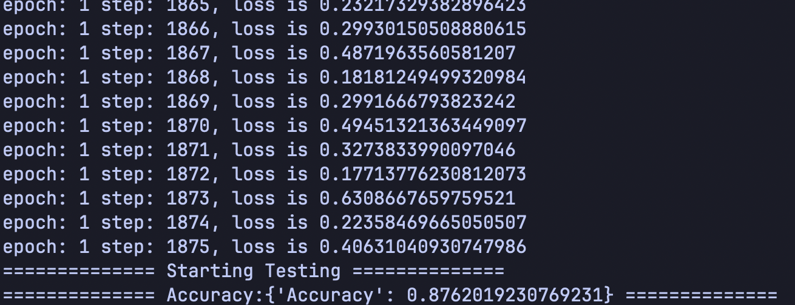

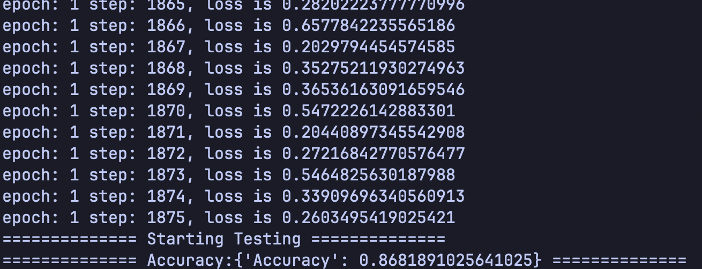

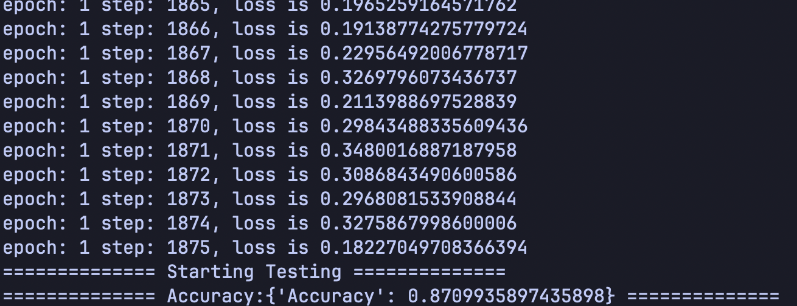

有一些提高，但是不太稳定。

将学习率从0.01改为0.001。

**结果**

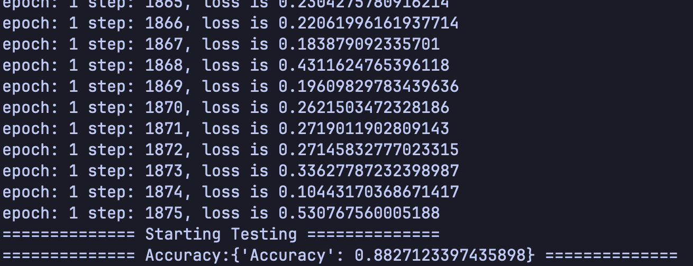

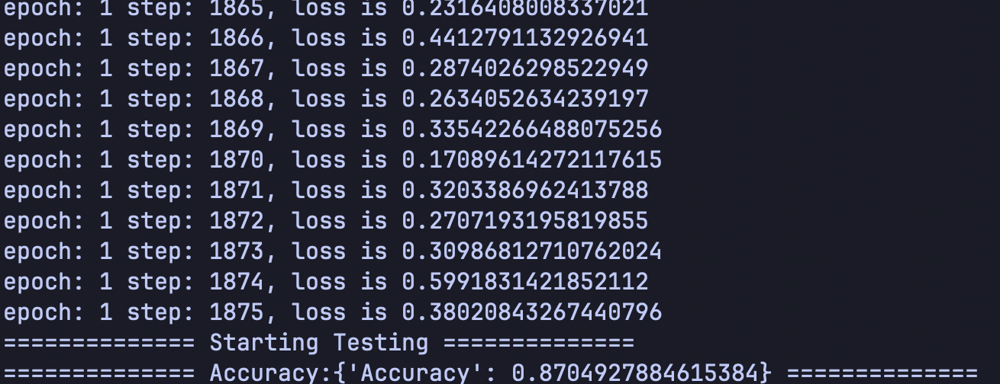

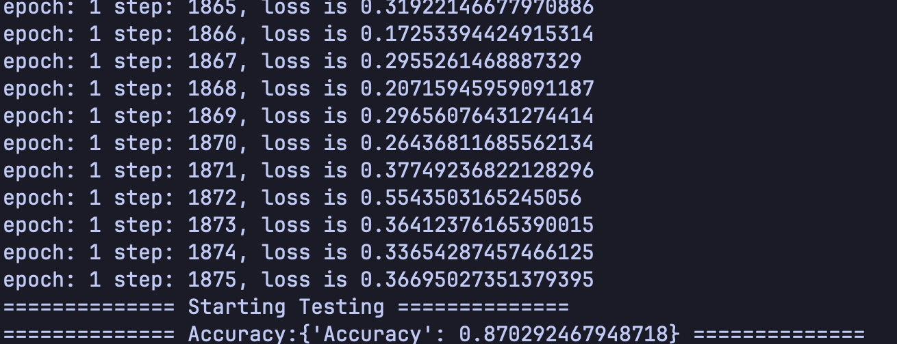

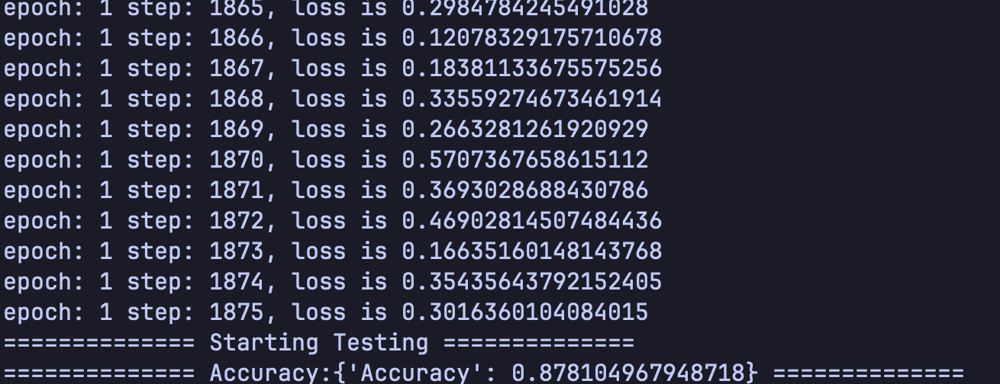

准确率稳定在0.87往上了。

#### 使用并行连接网络

原代码：

```python
def __init__(self, num_class=10, num_channel=1):
    super(LeNet5, self).__init__()
    self.conv1 = nn.Conv2d(num_channel, 6, 5, pad_mode="valid")
    self.conv2 = nn.Conv2d(6, 16, 5, pad_mode="valid")
    self.fc1 = nn.Dense(16 * 5 * 5, 120, weight_init=Normal(0.02))
    self.fc2 = nn.Dense(120, 84, weight_init=Normal(0.02))
    self.fc3 = nn.Dense(84, num_class, weight_init=Normal(0.02))
    self.relu = nn.ReLU()
    self.max_pool2d = nn.MaxPool2d(kernel_size=2, stride=2)
    self.flatten = nn.Flatten()

def construct(self, x):
    x = self.max_pool2d(self.relu(self.conv1(x)))
    x = self.max_pool2d(self.relu(self.conv2(x)))
    x = self.flatten(x)
    x = self.relu(self.fc1(x))
    x = self.relu(self.fc2(x))
    x = self.fc3(x)
    return x
```

修改后：

```python
def __init__(self, num_class=10, num_channel=1):
    super(LeNet5, self).__init__()
    self.conv1 = nn.Conv2d(num_channel, 32, 3, pad_mode="same")
    self.conv2 = nn.Conv2d(num_channel, 32, 5, pad_mode="same")
    self.conv3 = nn.Conv2d(num_channel, 32, 7, pad_mode="same")
    self.conv4 = nn.Conv2d(32 * 3, 64, 3, pad_mode="valid")
    self.bn1 = nn.BatchNorm2d(32)
    self.bn2 = nn.BatchNorm2d(32)
    self.bn3 = nn.BatchNorm2d(32)
    self.bn4 = nn.BatchNorm2d(64)
    self.fc1 = nn.Dense(64 * 7 * 7, 256, weight_init=Normal(0.02))
    self.fc2 = nn.Dense(256, 128, weight_init=Normal(0.02))
    self.fc3 = nn.Dense(128, num_class, weight_init=Normal(0.02))
    self.relu = nn.ReLU()
    self.max_pool2d = nn.MaxPool2d(kernel_size=2, stride=2)
    self.flatten = nn.Flatten()

def construct(self, x):
    branch1 = self.max_pool2d(self.relu(self.bn1(self.conv1(x))))
    branch2 = self.max_pool2d(self.relu(self.bn2(self.conv2(x))))
    branch3 = self.max_pool2d(self.relu(self.bn3(self.conv3(x))))

    x = ops.concat((branch1, branch2, branch3), axis=1)

    x = self.max_pool2d(self.relu(self.bn4(self.conv4(x))))

    x = self.flatten(x)
    x = self.relu(self.fc1(x))
    x = self.relu(self.fc2(x))
    x = self.fc3(x)
    return x
```

我使用了有3个卷积核的并行网络，卷积核尺寸分别为：3x3，5x5和7x7。将卷积结果池化后进行连接，再使用3x3大小的卷积核进行卷积。

**结果**

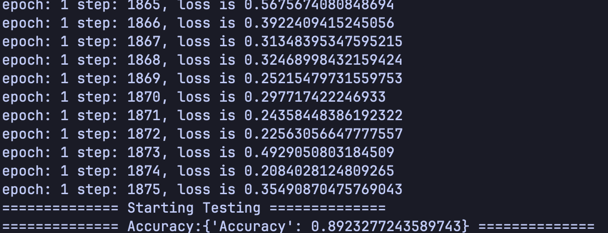


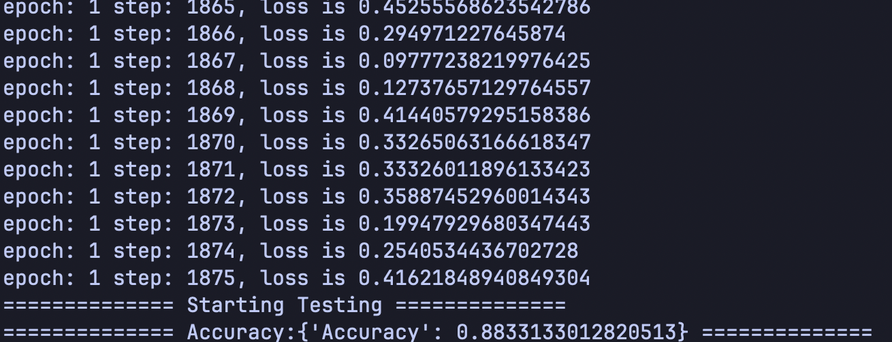

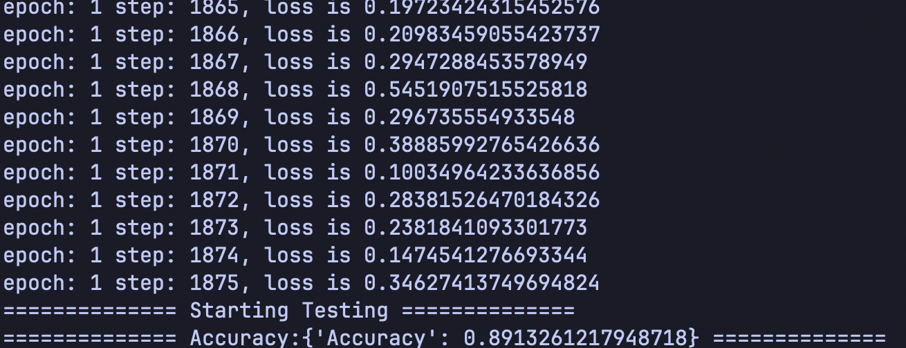

准确率可以稳定在0.88往上，基本可以到达0.89。

#### 其他修改

* 添加 dropout，效果不太好，准确率下降了。
* 修改超参数，略微提升了一些准确率。

**结果**


目前训练出来的最优秀的准确率。

## 5. 完成情况与结果分析

### 5.1. 用 BP 神经网络拟合正弦曲线，并绘图比较实际效果


使用 BP 神经网络对正弦曲线进行拟合的效果优秀，准确率达到99%以上。

### 5.2. LeNet 的 MindSpore 实现


成功运行，在 MNIST 数据集上的准确率达到98%。

### 5.3. 对 LeNet-5 的改进


通过各种修改，将 LeNet 在 Fashion_MNIST 上的准确率从85%提升到最高89.5%。

## 6. 总结

在任务二中，我学习了各种有关人工智能的理论知识，并且通过实践将这些理论转化为代码，完成了简单的人工智能模型训练。接着我了解了 MindSpore 框架，并使用 MindSpore 实现了 LeNet 的训练。最后，针对 LeNet 在 Fashion_MNIST 数据集上的准确率下降问题，我对模型进行了诸多修改，实现了准确率从85%到最高89.5%的增长。这次任务让我对人工智能的训练有了初步的了解，并且也通过动手修改 LeNet 框架，锻炼了我的编程能力。
